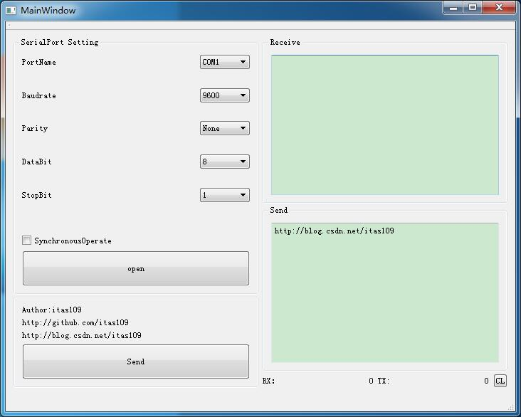
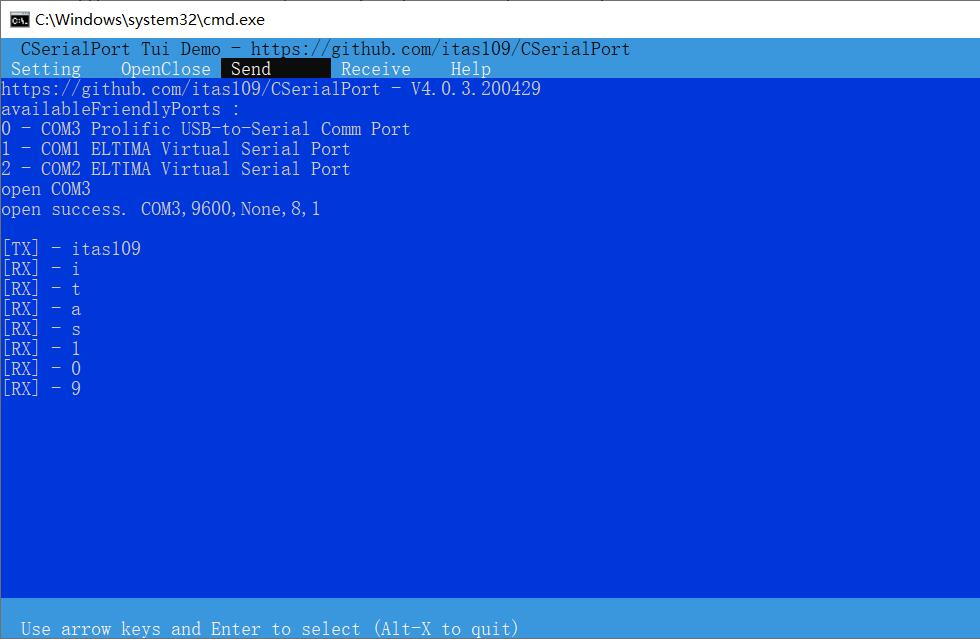
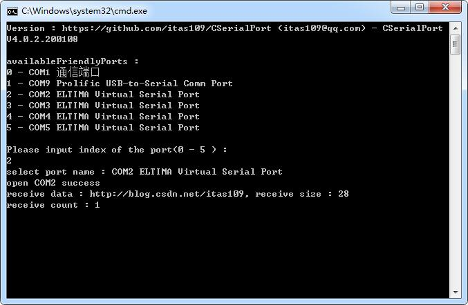

<p align="center">CSerialPort</p>

<p align="center">
<a href="https://github.com/itas109/CSerialPort/releases"></a>
<a href="https://github.com/itas109/CSerialPort/stargazers"></a>
<a href="https://github.com/itas109/CSerialPort/network/members"></a>
<a href="https://github.com/itas109/CSerialPort/blob/master/LICENSE"></a>

</p>

<p align="center">
Language: <strong>English</strong> / <a href="README.md">Chinese 中文</a>
</p>

a lightweight library of serial port, which can easy to read and write serical port on windows and linux with C++

---

# Design Principles

* Cross-platform
* Easy use
* higher efficiency

# Todo List

## Strategic Goal

- [x] 1.support windows and linux first
- [ ] 2.add communicating protocol
- [ ] 3.support hot swap
- [ ] 4.higher efficiency notify module
- [ ] 5.support other language,such as C, C#, Python, Java, Golang
- [x] 6.sync serial port communication
- [ ] 7.new cross-platform gui serial port tool
- [ ] 8.add a video description of this class
- [ ] 9.comm monitor hook

## Short-term Goal

- [x] 1.cross-platform OS identify class
- [ ] 2.cross-platform Thread class
- [ ] 3.cross-platform Lock class
- [ ] 4.cross-platform higher efficiency Timer class
- [ ] 5.Performance test report(Throughput && delay && packet dropout rates)

# Last Modify

## Version: 4.0.3.200429
by itas109 on 2020-04-29

# Quick Start
## Windows
* cmake(**recommend**)
```
git clone https://github.com/itas109/CSerialPort.git

cd CSerialPort\Demo\CommNoGui

mkdir bin

cd bin

cmake ..
```
* MSVC

```
git clone https://github.com/itas109/CSerialPort.git

cd CSerialPort\Demo\CommNoGui

compile-MSVC.bat

CSerialPortDemoNoGui-MSVC.exe
```

* MinGW
```
git clone https://github.com/itas109/CSerialPort.git

cd CSerialPort\Demo\CommNoGui

compile-MinGW.bat

CSerialPortDemoNoGui-MinGW.exe
```

## Linux
* cmake(**recommend**)
```
git clone https://github.com/itas109/CSerialPort.git

cd CSerialPort\Demo\CommNoGui

mkdir bin

cd bin

cmake ..

make

./CSerialPortDemoNoGui
```
* makefile
```
git clone https://github.com/itas109/CSerialPort.git
cd CSerialPort\Demo\CommNoGui

make
./CSerialPortDemoNoGui
```
* shell
```
git clone https://github.com/itas109/CSerialPort.git
cd CSerialPort\Demo\CommNoGui

chmod +x compile.sh
./compile.sh
./CSerialPortDemoNoGui
```

# Tested Machine

| OS | Arch | Gui | compiler | version | testing time |
| :-----:| :----: | :----: | :----: | :----: | :----: |
| DeepIn 15.11 64bit CN | x86_64 | QT 5.12.6 | GCC 6.3.0 | 4.0.3 |2020-04-29|
| NeoKylin Server 7.0 CN| x86_64 | NoGui | GCC 4.8.5 | 4.0.3 |2020-04-29|
| Win7 Ultimate 64bit CN | x86_64 | QT 5.6.2 | MSVC2013u5 32bit | 4.0.3 |2020-04-29|
| Win7 Ultimate 64bit CN | x86_64 | QT 5.12.7 | MSVC2017 64bit |  4.0.3 |2020-04-29|
| Win7 Ultimate 64bit CN | x86_64 | NoGui | MinGW73 64bit |  4.0.3 |2020-04-29|
| Win7 Ultimate 64bit CN | x86_64 | NoGui | MinGW48 32bit |  4.0.3 |2020-04-29|
| Win7 Ultimate 64bit CN | x86_64 | MFC | MSVC2013u5 32bit |  4.0.3 |2020-04-29|
| Win7 Ultimate 64bit CN | x86_64 | MFC | MSVC2015u3 32bit |  4.0.3 |2020-04-29|
| Win10 Enterprise 64bit CN | x86_64 | MFC | MSVC2015u3 32bit | 4.0.3 |2020-04-29|
| Win10 Enterprise 64bit CN | x86_64 | QT 5.12.7 | MinGW73 64bit | 4.0.3 |2020-04-29|
| Linux raspberrypi 4.9.70 | armv7l | NoGUi | GCC 4.9.2 |  4.0.3 |2020-04-29|

# Result

## Linux：

### Gui

Demo Path: CSerialPort/Demo/CommQT


### Tui

Demo Path: CSerialPort/Demo/CommTui


### No Gui

Demo Path: CSerialPort/Demo/CommNoGui


## Windows:

### Gui

Demo Path: CSerialPort/Demo/CommQT



### Tui

Demo Path: CSerialPort/Demo/CommTui




### No Gui

Demo Path: CSerialPort/Demo/CommNoGui


# Directory List

[Directory List Document](./doc/directory_list.md)

# Error Guide

[Error Guide Document](./doc/error_guide.md)

# Frequently Asked Questions

[Frequently Asked Questions](./doc/FAQ.md)

# Contacting

* Email : itas109@qq.com

* QQ Group : [129518033](http://shang.qq.com/wpa/qunwpa?idkey=2888fa15c4513e6bfb9347052f36e437d919b2377161862948b2a49576679fc6)

# Links

* [CSDN Blog](http://blog.csdn.net/itas109)
* [Github](https://github.com/itas109/CSerialPort)
* [Gitee](https://gitee.com/itas109/CSerialPort)

# CSerialPort-based Applications
Welcome to add

# Donate

---
# Other branches

Remon Spekreijse's serial library has had a profound impact on me, thanks again to Remon Spekreijse
http://www.codeguru.com/cpp/i-n/network/serialcommunications/article.php/c2483/A-communication-class-for-serial-port.htm


only for windows branches : 
https://github.com/itas109/CSerialPort/tree/CSerialPort_win_3.0.3

---

# License

since V3.0.0.171216 use [GNU Lesser General Public License v3.0](LICENSE)
