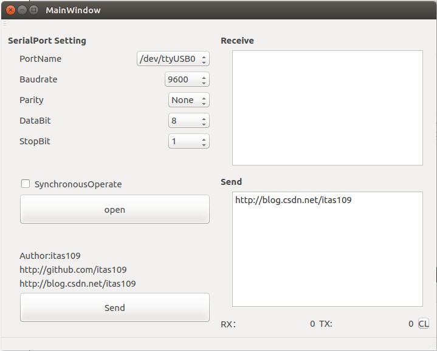
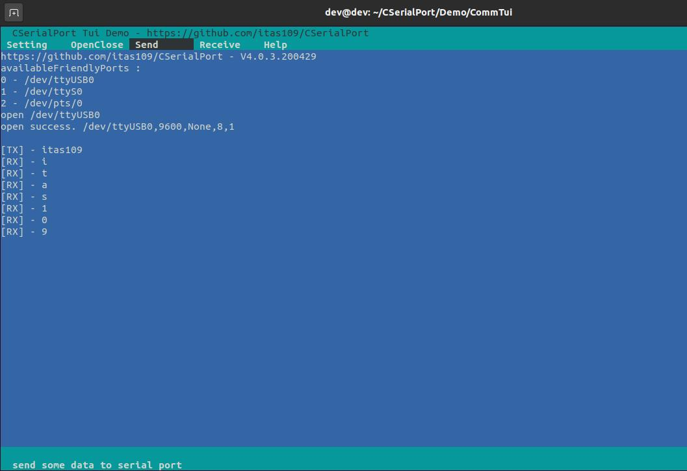
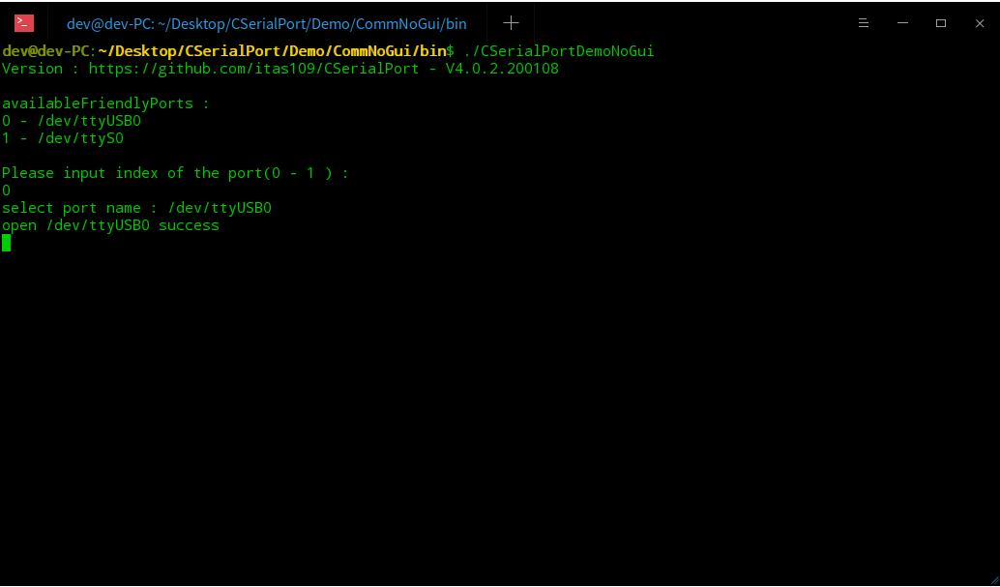
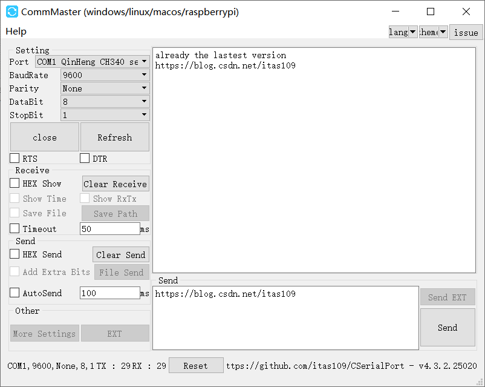

<p align="center">CSerialPort</p>

<p align="center">
<a href="https://github.com/itas109/CSerialPort/releases"></a>
<a href="https://github.com/itas109/CSerialPort/stargazers"></a>
<a href="https://gitee.com/itas109/CSerialPort"></a>
<a href="https://github.com/itas109/CSerialPort/network/members"></a>
<a href="https://github.com/itas109/CSerialPort/blob/master/LICENSE"></a>


</p>

<p align="center">
Language: <strong>English</strong> / <a href="README.md">中文</a>
</p>

Lightweight cross-platform serial port library based on C++, which can easy to read and write serial port on mutiple operating system

---

# Design Principles

* Cross-platform
* Easy use
* higher efficiency

# Platform
CSerialPort has been tested to the following platforms:

   - DOS ( x86_64 )
   - Windows ( x86_64 )
   - Linux ( x86_64, aarch64, mips64el, s390x, ppc64le )
   - macOS ( x86_64 )
   - Raspberry Pi ( armv7l )
   - FreeBSD ( x86_64 )
   - ...

# Todo List

## Strategic Goal

- [x] 1.support windows and linux first
- [ ] 2.add communicating protocol
- [ ] 3.support hot swap
- [ ] 4.higher efficiency notify module
- [ ] 5.support other language,such as C, C#, Python, Java, Golang
- [x] 6.sync serial port communication
- [X] 7.new cross-platform gui serial port tool
- [ ] 8.add a video description of this class
- [ ] 9.comm monitor hook

## Short-term Goal

- [x] 1.cross-platform OS identify class
- [ ] 2.cross-platform Thread class
- [ ] 3.cross-platform Lock class
- [ ] 4.cross-platform higher efficiency Timer class
- [ ] 5.Performance test report(Throughput && delay && packet dropout rates)

# Last Modify

## Version: 4.1.0.201010
by itas109 on 2020-10-10

# Quick Start

```
$ git clone --depth=1 https://github.com/itas109/CSerialPort.git
$ cd CSerialPort
$ mkdir bin && cd bin
$ cmake ..
$ cmake --build .
```

# Screenshot

## Gui

Demo Path: CSerialPort/examples/CommQT



## Tui

Demo Path: CSerialPort/examples/CommTui



## No Gui

Demo Path: CSerialPort/examples/CommNoGui



# Directory List

[Directory List Document](./doc/directory_list.md)

# Error Guide

[Error Guide Document](./doc/error_guide.md)

# Frequently Asked Questions

[Frequently Asked Questions](./doc/FAQ.md)

# Contacting

* Email : itas109@qq.com

* QQ Group : [129518033](http://shang.qq.com/wpa/qunwpa?idkey=2888fa15c4513e6bfb9347052f36e437d919b2377161862948b2a49576679fc6)

# Links

* [CSDN Blog](https://blog.csdn.net/itas109)
* [Github](https://github.com/itas109/CSerialPort)
* [Gitee](https://gitee.com/itas109/CSerialPort)

# CSerialPort-based Applications
## 1.[CommMaster](https://gitee.com/itas109/CommMaster)
* support windows/linux/macos/raspberrypi and so on
* support custom port name
* support custom baudrate
* support custom language
* support custom theme

https://gitee.com/itas109/CommMaster



## 2.[CommLite](https://github.com/itas109/CommLite)

CommLite is tui's serial port tool based CSerialPort

* support x86, arm, mips cpu architecture
* support windows dos, linux, macos,raspberrypi, freebsd operating system

https://github.com/itas109/CommLite


# Donate

[CSDN Blog](https://blog.csdn.net/itas109)

---
# Other branches

Remon Spekreijse's serial library has had a profound impact on me, thanks again to Remon Spekreijse
http://www.codeguru.com/cpp/i-n/network/serialcommunications/article.php/c2483/A-communication-class-for-serial-port.htm


only for windows branches : 
https://github.com/itas109/CSerialPort/tree/CSerialPort_win_3.0.3

---

# License

since V3.0.0.171216 use [GNU Lesser General Public License v3.0](LICENSE)
