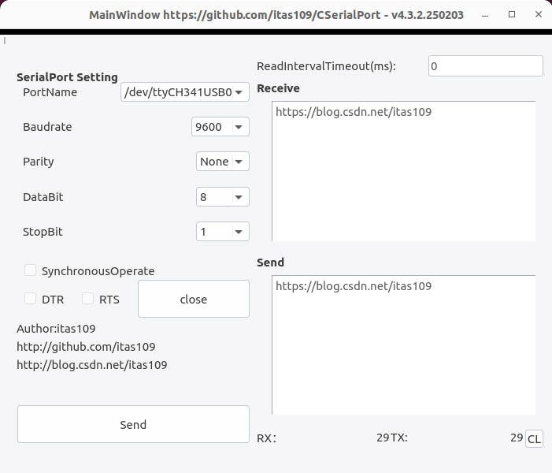
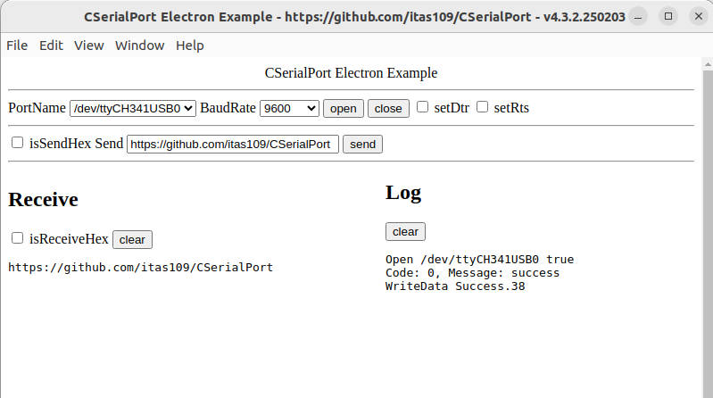
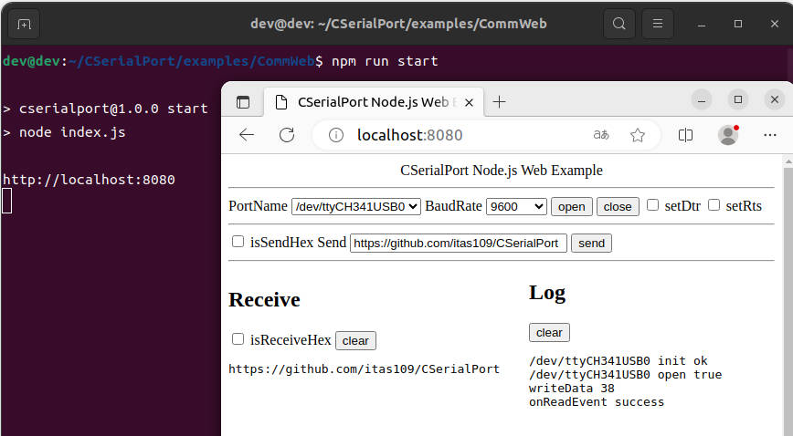

# [CSerialPort](https://github.com/itas109/CSerialPort)

[中文](README_zh_CN.md)

CSerialPort is a lightweight cross-platform serial port library based on C++, which can easy to read and write serial port on multiple operating system. Also support C, C#, Java, Python, Node.js, Electron, Rust etc.

<p>
<a href="https://github.com/itas109/CSerialPort/releases"></a>
<a href="https://github.com/itas109/CSerialPort/stargazers"></a>
<a href="https://gitee.com/itas109/CSerialPort"></a>
<a href="https://github.com/itas109/CSerialPort/blob/master/LICENSE"></a>


<!--  -->
</p>

---

# Design Principles

- Cross-platform
- Easy to use
- Higher efficiency

# Platform

CSerialPort was tested on the following platforms

- Windows ( x86, x86_64, arm64 )
- Linux ( x86, x86_64, arm, arm64/aarch64, mips64el, riscv, s390x, ppc64le )
- macOS ( x86_64, apple silicon )
- Android ( armeabi-v7a, arm64-v8a, x86, x86_64 )
- FreeBSD ( x86_64 )
- ...

# Todo List

## Long-term Goal

- [x] 1.support windows and linux first
- [x] 2.support common communication protocol - [CommNoGuiProtocol](https://github.com/itas109/CSerialPort/tree/master/examples/CommNoGuiProtocol)
- [x] 3.support hot plug notify - CSerialPortHotPlugListener
- [x] 4.higher efficiency notify module - replace with CSerialPortListener
- [x] 5.support other language - C, C#, Java, Python, Node.js, Electron, Rust etc. - more information [bindings](https://github.com/itas109/CSerialPort/tree/master/bindings)
- [x] 6.sync serial port communication
- [x] 7.new cross-platform gui serial port tool - [CommMaster](https://gitee.com/itas109/CommMaster)
- [x] 8.add introduction and tutorial of CSerialPort - [CSerialPort Tutorial ](https://blog.csdn.net/itas109/category_12416341.html)
- [ ] 9.serial port monitor hook

## Short-term Goal

- [x] 1.cross-platform OS identify class
- [x] 2.cross-platform thread class
- [x] 3.cross-platform lock class
- [x] 4.cross-platform higher efficiency timer class
- [ ] 5.cross-platform thread pool class
- [ ] 6.Performance test report(Throughput && delay && packet dropout rates)

# Latest version

## Version: 4.3.2.250203
by itas109 on 2025-02-03

# Quick Start

```
$ git clone --depth=1 https://github.com/itas109/CSerialPort.git
$ cd CSerialPort
$ mkdir bin && cd bin
$ cmake ..
$ cmake --build .
```

run demo ( for example serial port lookback test on linux)

```
CSerialPort/bin $ ./CSerialPortDemoNoGui 
[INFO] CSerialPort - OS: Linux, ProductName: Ubuntu 22.04.2 LTS, Arch: x86_64, ProcessorNum: 4, Compiler: gcc(11.4.0), Bit: 64, C++: 201703L, Bindings: , Version: https://github.com/itas109/CSerialPort - v4.3.2.250203
Version: https://github.com/itas109/CSerialPort - v4.3.2.250203

AvailableFriendlyPorts:
1 - /dev/ttyCH341USB0 QinHeng CH340 serial converter 1a86:7523
2 - /dev/pts/0 0 pty terminal

Please Input The Index Of Port(1 - 2)
1
Port Name: /dev/ttyCH341USB0
[INFO] openPort - portName: /dev/ttyCH341USB0, baudRate: 9600, dataBit: 8, parity: 0, stopBit: 0, flowControl: 0, mode: async, readBufferSize:4096(4096), readIntervalTimeoutMS: 0, minByteReadNotify: 1, byteReadBufferFullNotify: 3276
[INFO] openPort - open /dev/ttyCH341USB0. code: 0, message: success
Open /dev/ttyCH341USB0 Success
Code: 0, Message: success
[INFO] writeData - write. len: 5, hex(top100): 3132333435
[INFO] writeData - write. len: 7, hex(top100): 69746173313039
[INFO] commThreadMonitor - write buffer(usedLen 12). len: 12, hex(top100): 313233343569746173313039
[INFO] commThreadMonitor - onReadEvent min read byte. portName: /dev/ttyCH341USB0, readLen: 12
[INFO] readData - read. len: 12, hex(top100): 313233343569746173313039
/dev/ttyCH341USB0 - Count: 1, Length: 12, Str: 12345itas109, Hex: 0x31 0x32 0x33 0x34 0x35 0x69 0x74 0x61 0x73 0x31 0x30 0x39
```

# Install CSerialPort Using Vcpkg

You can download and install CSerialPort using the [vcpkg](https://github.com/Microsoft/vcpkg/) dependency manager

```
$ git clone https://github.com/Microsoft/vcpkg.git
$ cd vcpkg
$ ./bootstrap-vcpkg.sh
$ ./vcpkg install cserialport
```

# Cross Compile

- arm on ubuntu 20.04

```
$ sudo apt-get install g++-arm-linux-gnueabi
$ cd CSerialPort
$ mkdir bin_arm && cd bin_arm
$ cmake .. -DCMAKE_TOOLCHAIN_FILE=./cmake/toolchain_arm.cmake
$ cmake --build .
```

- aarch64 on ubuntu 20.04

```
$ sudo apt-get install g++-aarch64-linux-gnu
$ cd CSerialPort
$ mkdir bin_aarch64 && cd bin_aarch64
$ cmake .. -DCMAKE_TOOLCHAIN_FILE=./cmake/toolchain_aarch64.cmake
$ cmake --build .
```

- mips64el on ubuntu 20.04

```
$ sudo apt-get install g++-mips64el-linux-gnuabi64
$ cd CSerialPort
$ mkdir bin_mips64el && cd bin_mips64el
$ cmake .. -DCMAKE_TOOLCHAIN_FILE=./cmake/toolchain_mips64el.cmake
$ cmake --build .
```

- riscv64 on ubuntu 20.04

```
$ sudo apt-get install g++-riscv64-linux-gnu
$ cd CSerialPort
$ mkdir bin_riscv64 && cd bin_riscv64
$ cmake .. -DCMAKE_TOOLCHAIN_FILE=./cmake/toolchain_riscv64.cmake
$ cmake --build .
```

# Screenshot

## Gui

Demo Path: CSerialPort/examples/CommQT



Demo Path: CSerialPort/examples/CommElectron



## Web

Demo Path: CSerialPort/examples/CommWeb



## No Gui

Demo Path: CSerialPort/examples/CommNoGui


# Documents

[API Document](doc/CSerialPort_doc_en.chm)
[Directory List Document](doc/directory_list.md)
[Error Guide Document](doc/error_guide.md)
[Frequently Asked Questions](doc/FAQ.md)

# Contacting

- Email : itas109@qq.com
- QQ Group : [129518033](http://shang.qq.com/wpa/qunwpa?idkey=2888fa15c4513e6bfb9347052f36e437d919b2377161862948b2a49576679fc6)

# Links

- [CSDN Blog](https://blog.csdn.net/itas109)
- [Github](https://github.com/itas109/CSerialPort)
- [Gitee](https://gitee.com/itas109/CSerialPort)

# CSerialPort-based Applications
## 1. [CommMaster](https://gitee.com/itas109/CommMaster)

- support windows/linux/macos/raspberrypi and so on
- support custom port name
- support custom baudrate
- support custom language
- support custom theme

https://gitee.com/itas109/CommMaster


# Donate

[CSDN Blog](https://blog.csdn.net/itas109)

---

# Other branches

Only for windows branch : https://github.com/itas109/CSerialPort/tree/CSerialPort_win_3.0.3

Thanks for [Remon Spekreijse's serial library](http://www.codeguru.com/cpp/i-n/network/serialcommunications/article.php/c2483/A-communication-class-for-serial-port.htm)

---

# License

CSerialPort v3.0.0.171216 - v4.3.1.240204 is licensed under the LGPLv3

CSerialPort v4.3.2.250203 - latest is licensed under the [LGPLv3 with LGPL-3.0-linking-exception](LICENSE)