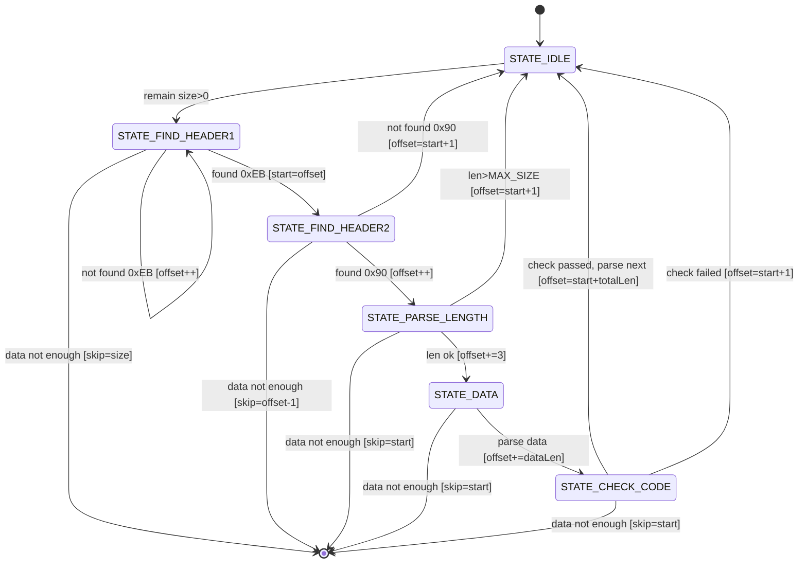

# Common Communication Protocol

## frame format

| offset | field       | length | comment                |
| ------ | ----------- | ------ | ---------------------- |
| 0      | header      | 2      | 0xEB90                 |
| 2      | version     | 1      | 0x00                   |
| 3      | data length | 2      | N                      |
| 5      | data        | N      |                        |
| 5 + N  | check code  | 2      | CRC-16/MODBUS(0x18005) |

By default, data longer than one byte use big endian.

```
 0      1      2      3      4      5      6...    N-2    N-1
+------+------+------+------+------+------+-----+------+------+
| 0xEB | 0x90 | Ver  | LenH | LenL | Data | ... | CRCH | CRCL |
+------+------+------+------+------+------+-----+------+------+
|<---------- fixed header -------->|<-- data -->|<--- CRC --->|
```

## example

- empty frame

```
EB90 00 0000 172D

header：0xEB90
version： 0x00
data length：0x0000
data：-
check code：0x172D
```
- standard frame

```
EB90 00 0007 20211025000000 7F52

header：0xEB90
version： 0x00
data length：0x0007
data：0x20211025000000
check code：0x7F52
```

## FSM

